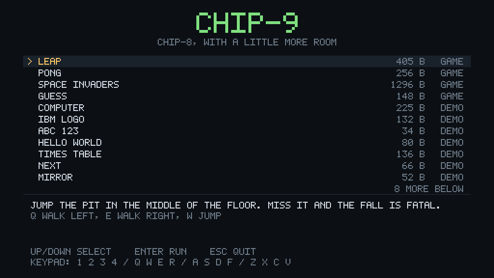
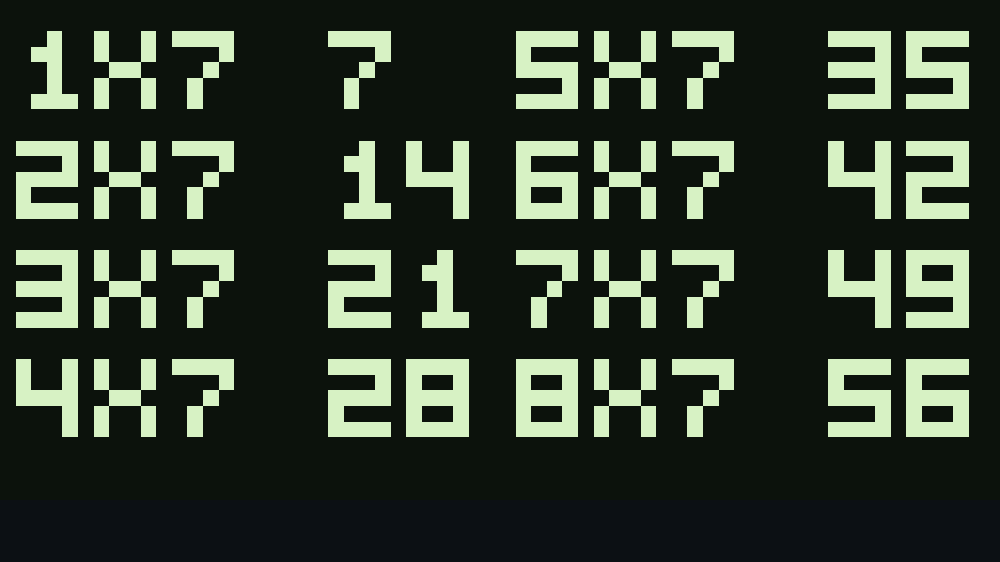

# chip9 — CHIP-8, with a little more room

CHIP-9 is CHIP-8 with the corners knocked off. It is the [Rust port](../rust)
of this repository's [JavaScript interpreter](../js), forked and extended with
the four things a CHIP-8 program most often wishes it had:

| | |
|---|---|
| **Multiply and divide** | `MUL Vx, Vy` and `DIV Vx, Vy`, with the overflow and the remainder in `VF` |
| **A data stack** | Sixty-four bytes, reached with `PUSH`, `POP` and `LD Vx, SP`, separate from the call stack |
| **A font that reaches `Z`** | Thirty six glyphs instead of sixteen, so `LD F, Vx` draws letters |
| **A language with functions** | **C9**, the C-like language, grown `&&`, `||`, arguments, return values and local variables |

**Every CHIP-8 program still runs unchanged.** The 35 original opcodes assemble
and execute exactly as they did, the first sixteen font glyphs are byte for byte
the CHIP-8 ones, and the whole original test suite still passes. The additions
sit in gaps the original instruction set left empty — `8xy8`, `8xy9`, `Fx01`,
`Fx02`, `Fx03` — so nothing had to move.

## Running

```sh
cd chip9
cargo run --release
```

Pick a program with the arrow keys and press `Enter`. To run your own program,
either choose *Load a program from a file...* and type a path, drop a `.ch8` file
onto the window, or pass one on the command line:

```sh
cargo run --release -- path\to\program.ch8
```



## What was added

### Multiply and divide

```asm
    LD  V0, 47
    LD  V1, 10
    MUL V0, V1      ; V0 = 214, VF = 1     (470 does not fit in a byte)
    LD  V0, 47
    DIV V0, V1      ; V0 = 4,   VF = 7     (quotient and remainder)
```

`MUL` keeps the low byte of the product and puts the high byte in `VF`, so
nothing is silently lost. `DIV` puts the remainder in `VF`, which is where C9's
`%` reads it from. Dividing by zero stops the machine and says so, rather than
quietly producing a number.

### A data stack

```asm
    PUSH V2         ; keep V2 safe across the call
    CALL show
    POP  V2         ; and take it back
    LD   V3, SP     ; how many bytes are on it
```

Sixty-four bytes, entirely separate from the sixteen-entry stack that `CALL` and
`RET` use, and the piece CHIP-8 was missing: somewhere to put a value that is
not a register. Overflowing it or popping an empty one stops the machine.

This is what lets a subroutine call itself. `show` in
[`programs/times.c9`](programs/times.c9) prints a number digit by digit by
recursing on `value / 10` — twelve lines that on CHIP-8 would need a hand-rolled
buffer and a fixed depth.

### A font that reaches `Z`

CHIP-8's font stops at `F`, because its sixteen glyphs are the sixteen
hexadecimal digits. CHIP-9 carries the idea on into base thirty six: the font
runs `0`–`9` and then `A`–`Z`, so `LD F, Vx` reaches every letter, and both the
assembler and C9 accept `'H'` as a way of writing 17.


Four columns is not much room for an alphabet, and three letters lose the
argument: `O` comes out the same shape as `0`, `S` the same as `5`, and `W` is
`M` upside down. That is the price of keeping every glyph four pixels wide, and
it is why the greeting above reads with a zero in it.

### C9, grown up

The [C-like language](programs/LANGUAGE.md) that came with the Rust port could
do what CHIP-8 could do: no `&&`, no locals, no arguments, no return values,
because there was nowhere to put them. With a data stack there is.

```c
// programs/times.c9, the whole of the printing
fn show(value) {
    if (value >= 10) show(value / 10);
    glyph(value % 10);
}
```

| Added | |
|---|---|
| `&&` and `\|\|` | short circuiting, in `if`, `while` and `do`/`while` |
| `*`, `/`, `%` | and `*=`, `/=`, `%=` |
| Function parameters | `fn write(from, count)`, passed on the data stack |
| `return expr;` | the value comes back in `V0` |
| Local variables | `var` inside a function or a `{ ... }` block, block scoped and shadowing |
| `'H'` | a character, meaning its index in the font |



Calls save the caller's own registers and nothing else, so a function that only
touches globals still compiles to a bare `CALL` — which is why
[`leap.c9`](programs/leap.c9) still produces the very same ROM its
[assembly](programs/leap.asm) does.

## Controls

The keypad follows the COSMAC VIP layout, so the sixteen keys of the original
hardware sit under the left hand:

```
   CHIP-9 keypad          keyboard
   1  2  3  C             1  2  3  4
   4  5  6  D             Q  W  E  R
   7  8  9  E             A  S  D  F
   A  0  B  F             Z  X  C  V
```

| Key                | Action                                     |
|--------------------|--------------------------------------------|
| `↑` / `↓`          | Move through the list (intro screen)       |
| `Enter` / `Space`  | Run the selected program (intro screen)    |
| `Ctrl`+`V`         | Paste a path into the file prompt          |
| `Space`            | Pause and resume (while a program runs)    |
| `F5`               | Restart the program                        |
| `-` / `=`          | Slow down or speed up the interpreter      |
| `Esc`              | Back to the intro screen, then quit        |

The speed is shown in the status bar in instructions per frame; the interpreter
runs 60 frames a second, so ten instructions per frame is 600 Hz, which is what
the JavaScript version used.

> Pong is two player: `1` and `Q` move the left paddle, `4` and `R` the right
> one.

## Writing a program

Two ways: an assembler, and C9, which compiles to the same instructions.

### C9, the language

```sh
cargo run --bin c9c -- programs/hello.c9 roms/hello.ch8
cargo run --bin c9c -- programs/hello.c9 roms/hello.ch8 --asm out.asm
```

C9 has `if`, `while`, `do`/`while`, `loop`, `goto`, functions with arguments and
return values, block-scoped locals, and expressions with `&&` and `||` — and
nothing the machine cannot do. Every value is a byte, variables are registers,
and a variable can be pinned to a particular one. `--asm` keeps the assembly the
compiler wrote, which is the quickest way to see what a piece of source turns
into.

**[`programs/LANGUAGE.md`](programs/LANGUAGE.md) is the tutorial.**

### The assembler

```sh
cargo run --bin asm -- programs/leap.asm roms/leap.ch8
cargo run --bin asm -- programs/leap.asm roms/leap.ch8 --listing
```

`--listing` prints the address and the bytes next to each line. It accepts the
35 original CHIP-8 opcodes plus the five CHIP-9 adds; a program that uses only
the first 35 will run on any interpreter.

**[`programs/TUTORIAL.md`](programs/TUTORIAL.md)** builds a program that writes
`ABC123` on the screen with the interpreter's built-in font, one instruction at
a time, and ends with a syntax reference and the full opcode table.

### The programs

| Program | What it is |
|---------|------------|
| [`programs/hello.c9`](programs/hello.c9) | `HELLO WORLD` out of the font, with a two-argument function |
| [`programs/times.c9`](programs/times.c9) | The seven times table: `MUL`, `DIV`, `%` and recursion |
| [`programs/abc123.c9`](programs/abc123.c9) · [`.asm`](programs/abc123.asm) | The tutorials' worked example, 34 bytes |
| [`programs/leap.c9`](programs/leap.c9) · [`.asm`](programs/leap.asm) | *Leap*, the bundled game |

`abc123` and `leap` are each written twice, once in each language. Compiling the
C9 and assembling the assembly produce identical files, and a test says so — so
neither copy can drift from the other, and neither can drift from the CHIP-8
port next door.

*Leap* is a side-on platformer: a floor with a pit in the middle, and a
character who walks with `Q` and `E` and jumps with `W`. Land in the pit and he
drops out of sight, `GAME OVER` appears, and the game starts again. It is
written entirely in the original instruction set — the jump arc comes from a
half-pixel Y coordinate and gravity applied every other tick, since there are no
fractions.


## SDL2

`cargo` does not build SDL2 from source here, so a prebuilt **SDL2 2.32.10
(x64, MSVC)** is vendored in [`lib/`](lib), the same way as in the sibling
`3drenderer` project:

```
lib/SDL2.lib          import library
lib/SDL2main.lib      import library
lib/SDL2.dll          runtime, copied next to the executable by build.rs
lib/SDL2-LICENSE.txt  zlib license
lib/README-SDL.txt
```

[`build.rs`](build.rs) adds `lib/` to the linker search path and copies
`SDL2.dll` into the target directory, so no manual setup is needed. Only
`x86_64-pc-windows-msvc` is wired up; on other targets, install SDL2 through the
system package manager and drop the `lib/` search path.

## Layout

The interpreter, [`src/cpu.rs`](src/cpu.rs), has no I/O in it at all: it owns
its memory, registers, stacks and framebuffer, and the front end reads them once
a frame. The rest of the modules mirror the JavaScript files one for one.

| JavaScript                            | Rust                                     |
|---------------------------------------|------------------------------------------|
| [`../js/chip8.js`](../js/chip8.js)       | [`src/cpu.rs`](src/cpu.rs)            |
| [`../js/keyboard.js`](../js/keyboard.js) | [`src/keypad.rs`](src/keypad.rs)      |
| [`../js/video.js`](../js/video.js)       | [`src/video.rs`](src/video.rs)        |
| [`../js/audio.js`](../js/audio.js)       | [`src/audio.rs`](src/audio.rs)        |
| [`../js/index.html`](../js/index.html)   | [`src/main.rs`](src/main.rs) and [`src/menu.rs`](src/menu.rs) |
| [`../js/programs.txt`](../js/programs.txt) | [`src/programs.rs`](src/programs.rs) and [`roms/`](roms) |

[`src/font.rs`](src/font.rs) and [`src/theme.rs`](src/theme.rs) have no
counterpart: the browser drew the interface with HTML and CSS, so the port
carries its own 5x7 bitmap font and palette. Neither has
[`src/asm.rs`](src/asm.rs), the assembler, exposed as a binary by
[`src/bin/asm.rs`](src/bin/asm.rs), nor [`src/lang/`](src/lang), the C9
compiler, exposed by [`src/bin/c9c.rs`](src/bin/c9c.rs).

The compiler is four files: [`lexer.rs`](src/lang/lexer.rs),
[`parser.rs`](src/lang/parser.rs) and [`codegen.rs`](src/lang/codegen.rs), read
in that order, plus [`mod.rs`](src/lang/mod.rs) which strings them together. It
emits assembly text and hands it to `src/asm.rs`, so there is only one
instruction encoder in the repository and only one set of tests for it.

Everything — the emulator screen, the menu, the status bar — is drawn into one
`0x00RRGGBB` buffer at window resolution and uploaded to a single streaming
texture once a frame, which is the same shape the JavaScript version had with
its canvas.

## Screenshots

To capture the pictures above without a display:

```sh
cargo run --release --example screenshots
```

This draws through the same framebuffer the application does and writes PNGs to
`screenshots/`.

## Tests

```sh
cargo test
```

| File | Covers |
|---|---|
| [`tests/cpu.rs`](tests/cpu.rs) | The original instruction set, with a bias towards what the JavaScript version got wrong |
| [`tests/chip9.rs`](tests/chip9.rs) | `MUL`, `DIV`, the data stack and the alphabet font |
| [`tests/asm.rs`](tests/asm.rs) | The committed ROMs against their assembly |
| [`tests/lang.rs`](tests/lang.rs) | What C9 compiles to, and that the C9 and assembly copies of a program agree byte for byte |
| [`tests/programs.rs`](tests/programs.rs) | Loading and running every bundled program |
| [`tests/leap.rs`](tests/leap.rs) | Playing the game with scripted key presses and reading the result out of the framebuffer |

## Differences from the CHIP-8 port

Two compiler bugs were found while adding the language features, and fixed here
only. Both were latent in [`../rust`](../rust) and are hard to hit with the
programs it ships.

* **A remembered value could go stale.** The compiler tracks what is in `V0` so
  it can skip a load that has already happened, but nothing forgot the value
  when a register it was worked out from was written. `y = x + 1; x = 9;
  z = x + 1;` dropped the second computation and gave `z` the old answer. Each
  remembered value now carries a bitmask of the registers it came from, filled
  in from the emitted text so no new instruction can escape the bookkeeping, and
  is forgotten when any of them is written.
* **A pinned register could be handed out twice.** `var a @ V2;` never marked
  `V2` as taken, so the next unpinned variable could be given it as well. Every
  declaration now books its register out, and hands it back when its scope ends.

Everything the Rust port fixed relative to the JavaScript original — the `Dxyn`
collision flag, sprite clipping, byte wrapping on `8xy5`/`8xy7`/`8xyE`, the
`Cxkk` range, the keypad numbering, the 60 Hz timers, unknown opcodes, focus
loss and `Fx0A` — is fixed here too. [`../rust/README.md`](../rust/README.md)
describes them.
