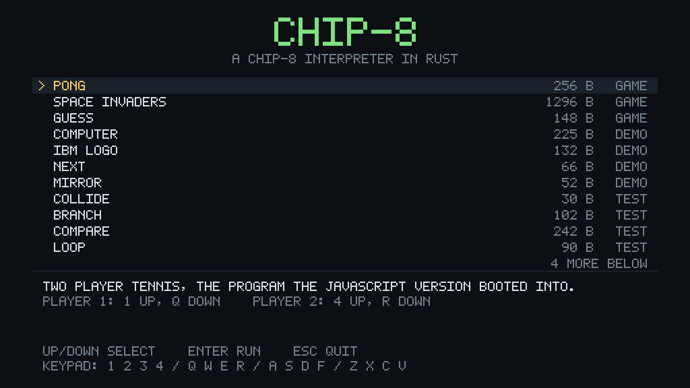

# chip8 — Rust

A Rust port of the JavaScript CHIP-8 interpreter in the repository root, running
on SDL2 instead of the browser.

It starts on an intro screen that lists every program from
[`../programs.txt`](../programs.txt), compiled into the executable, and can also
run a `.ch8` file from disk. The interpreter itself lives in
[`src/cpu.rs`](src/cpu.rs) and has no I/O in it at all: it owns its memory,
registers and framebuffer, and the front end reads them once a frame.

## Running

```sh
cd rust
cargo run --release
```

Pick a program with the arrow keys and press `Enter`. To run your own program,
either choose *Load a program from a file...* and type a path, drop a `.ch8` file
onto the window, or pass one on the command line:

```sh
cargo run --release -- path\to\program.ch8
```

## Controls

The keypad follows the COSMAC VIP layout, so the sixteen keys of the original
hardware sit under the left hand:

```
   CHIP-8 keypad          keyboard
   1  2  3  C             1  2  3  4
   4  5  6  D             Q  W  E  R
   7  8  9  E             A  S  D  F
   A  0  B  F             Z  X  C  V
```

| Key                | Action                                     |
|--------------------|--------------------------------------------|
| `↑` / `↓`          | Move through the list (intro screen)       |
| `Enter` / `Space`  | Run the selected program (intro screen)    |
| `Ctrl`+`V`         | Paste a path into the file prompt          |
| `Space`            | Pause and resume (while a program runs)    |
| `F5`               | Restart the program                        |
| `-` / `=`          | Slow down or speed up the interpreter      |
| `Esc`              | Back to the intro screen, then quit        |

The speed is shown in the status bar in instructions per frame; the interpreter
runs 60 frames a second, so ten instructions per frame is 600 Hz, which is what
the JavaScript version used.

> Pong is two player: `1` and `Q` move the left paddle, `4` and `R` the right
> one. `index.html` named `1`/`4` and `F`/`Z` because its keypad was misnumbered
> — see below.

## SDL2

`cargo` does not build SDL2 from source here, so a prebuilt **SDL2 2.32.10
(x64, MSVC)** is vendored in [`lib/`](lib), the same way as in the sibling
`3drenderer` project:

```
lib/SDL2.lib          import library
lib/SDL2main.lib      import library
lib/SDL2.dll          runtime, copied next to the executable by build.rs
lib/SDL2-LICENSE.txt  zlib license
lib/README-SDL.txt
```

[`build.rs`](build.rs) adds `lib/` to the linker search path and copies
`SDL2.dll` into the target directory, so no manual setup is needed. Only
`x86_64-pc-windows-msvc` is wired up; on other targets, install SDL2 through the
system package manager and drop the `lib/` search path.

## Layout

The modules mirror the JavaScript files one for one.

| JavaScript                            | Rust                                     |
|---------------------------------------|------------------------------------------|
| `chip8.js`                            | [`src/cpu.rs`](src/cpu.rs)               |
| `keyboard.js`                         | [`src/keypad.rs`](src/keypad.rs)         |
| `video.js`                            | [`src/video.rs`](src/video.rs)           |
| `audio.js`                            | [`src/audio.rs`](src/audio.rs)           |
| `index.html`                          | [`src/main.rs`](src/main.rs) and [`src/menu.rs`](src/menu.rs) |
| `programs.txt`                        | [`src/programs.rs`](src/programs.rs) and [`roms/`](roms) |

[`src/font.rs`](src/font.rs) and [`src/theme.rs`](src/theme.rs) have no
counterpart: the browser drew the interface with HTML and CSS, so the port
carries its own 5x7 bitmap font and palette.

Everything — the emulator screen, the menu, the status bar — is drawn into one
`0x00RRGGBB` buffer at window resolution and uploaded to a single streaming
texture once a frame, which is the same shape the JavaScript version had with
its canvas.

The programs were converted from the JavaScript byte arrays in
`../programs.txt` into `.ch8` files by
[`tools/extract_roms.py`](tools/extract_roms.py) and are compiled into the
executable with `include_bytes!`.

## Screenshots




To capture these without a display:

```sh
cargo run --release --example screenshots
```

This draws through the same framebuffer the application does and writes PNGs to
`screenshots/`.

## Tests

```sh
cargo test
```

[`tests/cpu.rs`](tests/cpu.rs) covers the instruction set, with a bias towards
the behaviour the JavaScript version got wrong, and
[`tests/programs.rs`](tests/programs.rs) loads and runs every bundled program.

## Differences from the JavaScript version

### Bugs fixed

* **`Dxyn` reported a collision almost every time it drew.** The original set
  `VF` from `!(bit ^ pixel) > 0`, which is `true` for every pixel a sprite
  leaves alone, and recomputed it for every pixel instead of latching it for
  the whole sprite. `VF` is now set once, after the sprite is drawn, and only
  when a lit pixel was erased.
* **Wrapped sprites wrote outside the framebuffer.** The wrap compared the
  coordinate against the screen size with `>` instead of `>=`. Sprites are now
  clipped at the edges, which is what the original hardware did and what the
  bundled *Vertical Clip* program checks; the starting position still wraps.
  [`Quirks::clip_sprites`](src/cpu.rs) turns the wrapping behaviour back on.
* **`8xy5`, `8xy7` and `8xyE` left values outside `0..=255` in a register**, so
  a subtraction could store `-1` and a shift `0x1FE`. Arithmetic now wraps in a
  byte, and writing a result into `VF` no longer overwrites the flag.
* **`Cxkk` could never produce `255`**: `Math.floor(Math.random() * 0xFF)` tops
  out at `254`. The port uses the full `0..=255` range.
* **The keypad was numbered `1` to `16`**, so `V` mapped to a key that does not
  exist and nothing at all produced `0x0`. The mapping is now the standard
  `0x0`–`0xF` layout shown above.
* **The timers ran off a 15 ms interval**, about 11% faster than the 60 Hz the
  hardware used. They are now ticked off the frame clock.
* **An opcode of `0x0000` was silently ignored**, so a program that ran off the
  end of its own code kept running through empty memory. Unknown opcodes, an
  unbalanced stack and out-of-range addresses now stop the program and explain
  themselves on screen. Two of the bundled test programs end exactly this way.
* **A key held while the page lost focus stayed down.** Focus loss now clears
  the keypad.
* **`Fx0A` acted on a key press.** It now waits for a key to be *released*,
  which is what programs written for the hardware expect, and ignores keys that
  were let go before the instruction started.

### Other changes

* An intro screen, so programs no longer have to be chosen by editing a source
  file.
* Programs can be loaded from disk: from the command line, from the file
  prompt, or by dropping a file onto the window.
* The interpreter can be paused, restarted and sped up or slowed down while it
  runs.
* A fixed-timestep loop drives the interpreter at exactly 60 Hz no matter what
  the display refresh rate is.
* The beep is a square wave with a short gain ramp, so starting and stopping it
  does not click the way an abruptly gated oscillator does.
